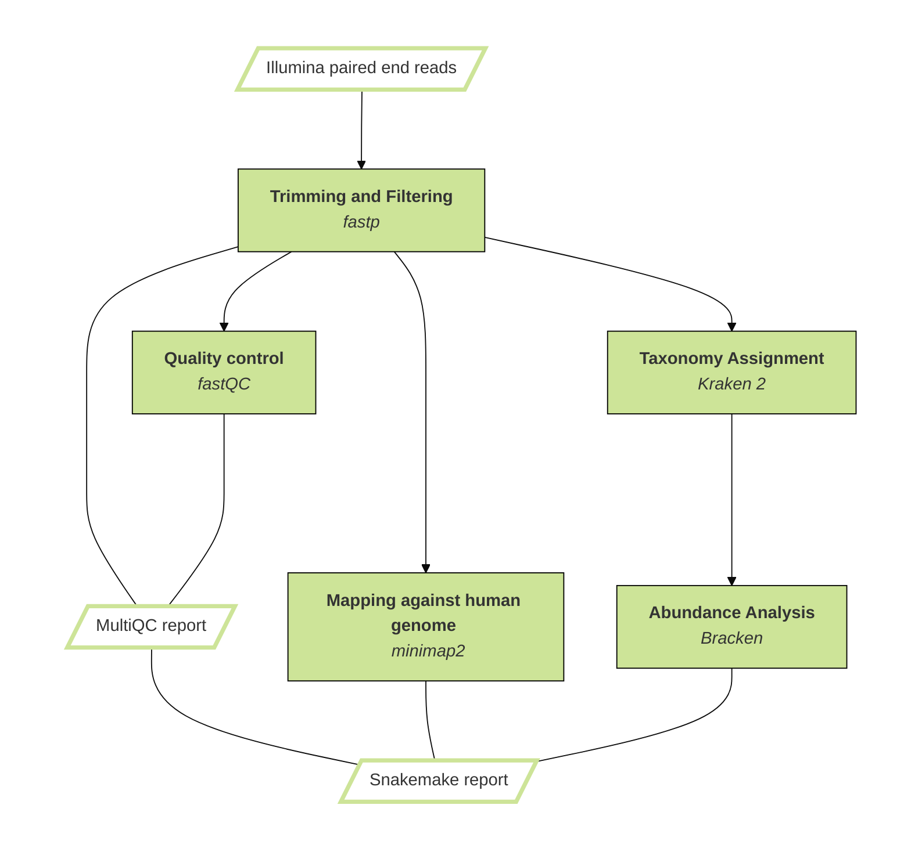

# QC for NextSeq

[](https://snakemake.github.io)
[](https://github.com/<owner>/<repo>/actions?query=branch%3Amain+workflow%3ATests)

A Snakemake workflow for quick quality control of Illumina MiSeq paired end data before sequencing on high throughput sequencing device (e.g. NextSeq).

## Usage

### Step 1: Install Snakemake

Snakemake is best installed via the [Mamba package manager](https://github.com/mamba-org/mamba) (a drop-in replacement for conda). If you have neither Conda nor Mamba, it can be installed via [Mambaforge](https://github.com/conda-forge/miniforge#mambaforge). For other options see [here](https://github.com/mamba-org/mamba).

Given that Mamba is installed, run

```sh
    mamba create -c conda-forge -c bioconda --name snakemake snakemake
```

to install Snakemake in an isolated environment. For all following commands ensure that this environment is activated via

```sh
    conda activate snakemake
```

### Step 2: Clone workflow

First, create an appropriate project working directory on your system and enter it:

```sh
    WORKDIR=path/to/project_workdir
    mkdir -p ${WORKDIR}
    cd ${WORKDIR}
```

In all following steps, we will assume that you are inside of that directory.

Second, to clone the full workflow run:

```sh
    git clone https://github.com/josefawelling/QC_pre_NextSeq.git
```

### Step 3: Configure workflow

#### Config file

To configure this workflow, modify `config/config.yaml` according to your needs, following the explanations provided in the file. It is especially recommended to provide the correct adapter sequences, so they can be trimmed appropriately.

#### Sample sheet

The sample sheet contains all samples to be analyzed.

#### Auto creation

You can choose to automatically create a sample sheet with all samples in a specified directory (modifications in `config/config.yaml`). Only `fastq.gz` files are taken into account. Additionally there is the option to rename the sequencers output FASTQ files during this step, e.g. from `sampleID_S40_L001_R1_001.fastq.gz` to `sampleID_R1.fastq.gz`.    
To create the sample sheet and provide it for the workflow, run:

```sh
    snakemake --cores all --use-conda create_sample_sheet
```

#### Manual creation or editing

Samples to be analyzed can also be added manually to the sample sheet.
For each sample, a new line in `config/pep/samples.csv` with the following content has to be defined:

- **sample_name**: name or identifier of sample
- **fq1**: path to read 1 in gzip FASTQ format
- **fq2**: path to read 2 in gzip FASTQ format


### Step 4: Run workflow

Given that the workflow has been properly deployed and configured, it can be executed as follows.

Fow running the workflow while deploying any necessary software via conda (using the Mamba package manager by default), run Snakemake with

```sh
    snakemake --cores all --use-conda
```

Snakemake will automatically detect the main Snakefile in the workflow subfolder and execute the workflow.

**Note:** By adding `--dry-run` or (`-n`) to the Snakemake command, you can see which steps shall be executed without actually running them.

The usage of this workflow is described in the [Snakemake Workflow Catalog](https://snakemake.github.io/snakemake-workflow-catalog/?usage=<owner>%2F<repo>).

## Workflow Overview




If you use this workflow in a paper, don't forget to give credits to the authors by citing the URL of this repository and its DOI (see above).
